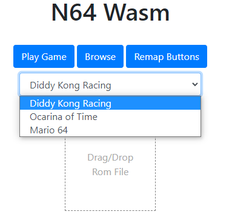
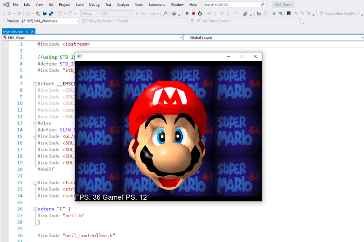
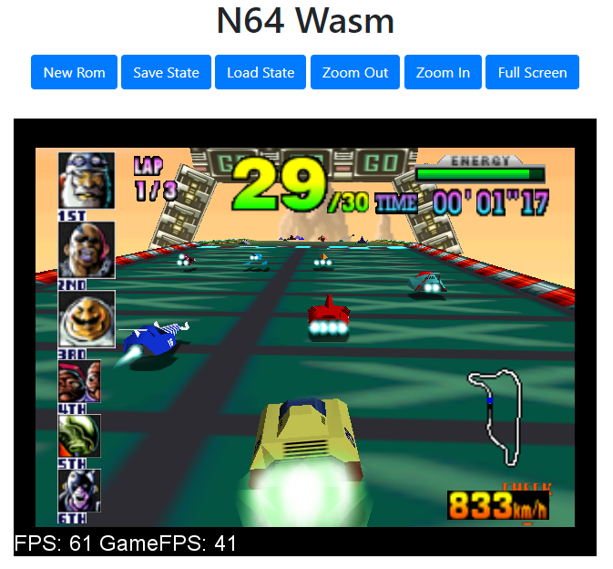
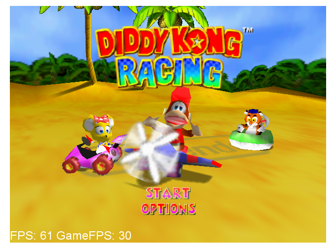
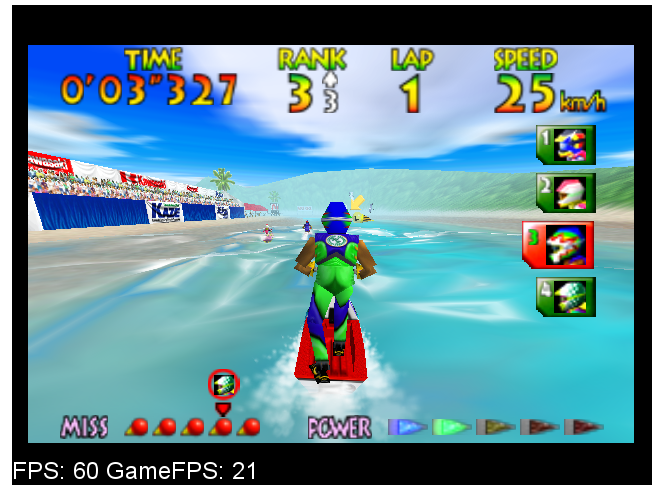
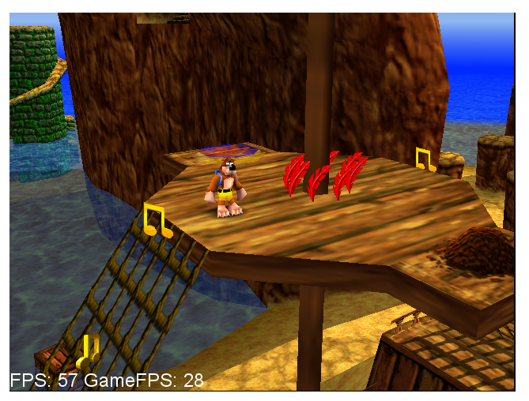
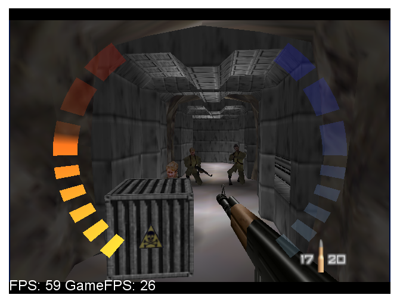
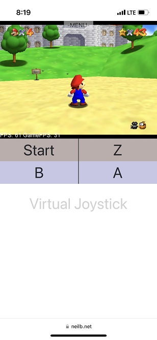

# N64 Wasm
Thanks for checking out N64 Wasm! An N64 emulator that runs in the browser. It is a port of the excellent RetroArch ParaLLEl Core to WebAssembly. This project started because I wanted to have a well playing open-source N64 emulator designed for the web. I also wanted to learn OpenGL and this was a good way to dive in. Game compatibility is decent with a good portion of the 3D games playable and at full speed on a mid-range computer - Mario 64, Ocarina of Time etc... There is currently an issue with some 2D games such as Dr Mario 64 and Pokemon Puzzle League which I am still investigating. I also tested on the iPhone 13 Pro and Xbox Series X Browser and it works great.

Supports the following features -
- Gamepad Support (Xbox and PS4 Controller tested)
- Button and Keyboard Remapping
- Save States
  - They save in your browser so you can close and come back later
- Import/Export Save Files (see settings.js)
- Zoom Controls
- Full Screen
- Audio Support
- Cloud Save States (Host your own server)


You can try it here: https://www.neilb.net/n64wasm/

# Build Instructions
I used WSL on Windows but any Linux environment would work as well. First Install Emscripten version 2.0.7
- create a folder somewhere in your environment to install emscripten
- git clone https://github.com/emscripten-core/emsdk.git
- cd emsdk
- ./emsdk install 2.0.7
- ./emsdk activate 2.0.7
- source ./emsdk_env.sh
- navigate back to the code folder in the N64Wasm repo
- run `make`
- then copy these 3 files from the code\ folder into the dist\ folder
  - n64wasm.data
  - n64wasm.js
  - n64wasm.wasm

# Hosting
This emulator supports hosting the app yourself with your own rom list. Create a folder called `roms` in the dist\ folder and copy them there. Then go into `romlist.js` and uncomment the code and populate the paths and names of your roms.

```javascript

var ROMLIST = [
    {url:"roms/rom1.z64",title:"Game 1"},
    {url:"roms/rom2.v64",title:"Game 2"},
    {url:"roms/rom3.v64",title:"Game 3"},
];

```
This will then display a dropdown on the UI to select a game



You can also enable Cloud Save States with some additional configuration. See this [README](server/README.md) for information on how to set that up.


# Windows Version
If you want to actually do debugging you will want to get the Windows version working on your machine. Debugging in WebAssembly is practically non-existant other than logging print statements. I did all of my debugging and testing using the Windows version with Visual Studio 2019 and then would compile the web version with Emscripten. Make sure you are on a computer that has a graphics card which supports OpenGL.

- To get it up and running open up the N64_Wasm.vcxproj file in notepad and update the paths
  - update all the paths for the includes and libraries to where these are on your machine
  - the ones referencing the code folders should be where your source code is
  - now you can open up N64_Wasm.vcxproj using Visual Studio 2019
- Get the Libraries and headers for the following
  - the actual versions could vary but these were the ones I used
  - SDL2 - version 2.0.14
  - SDL2 Image - version 2.0.5
  - SDL2 TTF - version 2.0.15
  - GLEW - version 2.2.0
- Copy a rom to your working directory
  - and replace the name of that rom in mymain.cpp
  - `sprintf(rom_name, "%s", "game.z64");`
- Note - running in Release mode runs much faster than in Debug though you won't be able to set breakpoints



# Screenshots







# iPhone 13 Pro


# References
- ParaLLEl N64 Core https://github.com/libretro/parallel-n64
