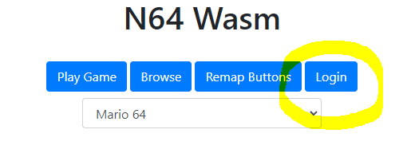
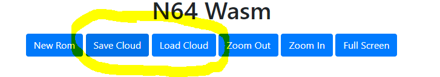

# Cloud Save States Setup
The following instructions will guide you in setting up your own server to host N64 Wasm with cloud save states. Or if you have experience with Docker you can set it up as a Container using the included Dockerfile in the `docker\` folder.

- Create the following folders within the "server" folder
  - `wwwroot\`
  - `roms\`
- Copy all of the files from the `dist\` folder into the `wwwroot\` folder
- Copy your roms into the `roms\` folder
- Update your `romlist.js` file with the roms you copied
- Update the CLOUDSAVEURL setting in your `settings.js` to this:
    ```javascript
        var N64WASMSETTINGS = {
            CLOUDSAVEURL: "api",
            SHOWADVANCED: false,
            SHOWOPTIONS: false
        }
    ```
- Change the password in `app.js`
    ```javascript
        const PASSWORD = "mypassword";
    ```
- Open the "server" folder from a terminal and run the following command
  - `npm install`
- To start the server run this command
  - `npm run start`
- Navigate to `http://localhost:5500`
- Click the "Login" button and enter the password you picked



- Now run a game and you will see that your buttons will say "Save Cloud" and "Load Cloud". Clicking these will now save/load your savestates to the server rather than inside your browser



# PHP Implementation
There is also a PHP implementation contributed by [@kimboslice99](https://github.com/kimboslice99) which you can view here [README](php/README.md)

